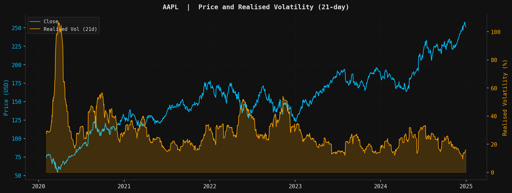
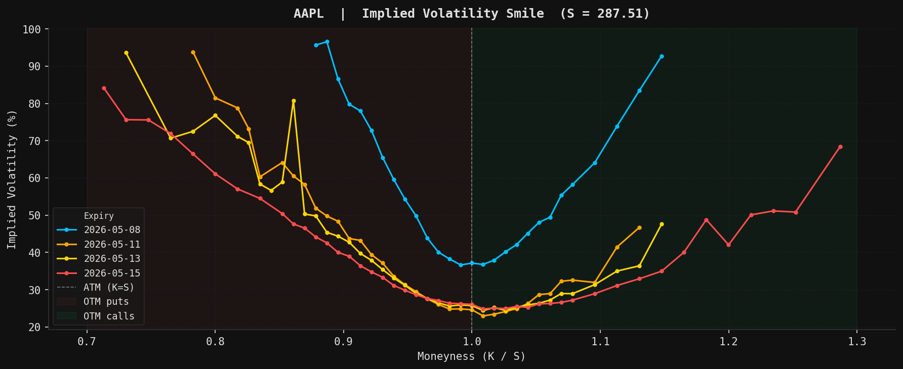
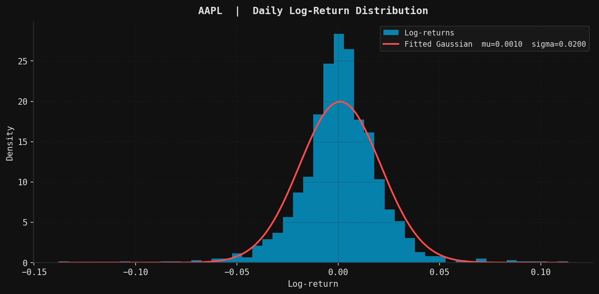
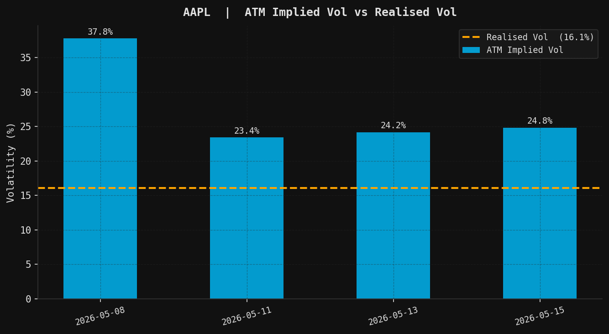

# Market Data Fetcher


A lightweight Python pipeline to fetch, clean and analyse market data via yfinance — historical OHLCV, live option chains, implied volatility extraction and visualisation.

Built as a reusable data layer for quantitative finance projects.

---

## Background

### OHLCV data

For each trading day, financial markets record five key values:

| Field | Description |
|-------|-------------|
| **Open** | First traded price of the day |
| **High** | Highest price reached during the day |
| **Low** | Lowest price reached during the day |
| **Close** | Last traded price before market close |
| **Volume** | Total number of shares exchanged |

The **adjusted close** (`auto_adjust=True`) corrects for dividends and stock splits. Without this adjustment, a 2-for-1 split appears as a 50% overnight price drop — completely distorting any return calculation.

### Log-returns

Raw prices are non-stationary (they trend over time) and cannot be directly modelled. Log-returns are stationary, approximately normally distributed, and additive across time:

$$r_t = \log\left(\frac{S_t}{S_{t-1}}\right)$$

This is exactly the discrete increment of a Geometric Brownian Motion (GBM) — the same model used in Black-Scholes option pricing.

### Realised volatility

Realised volatility is the rolling standard deviation of log-returns, annualised by $\sqrt{252}$:

$$\sigma_{\text{realised}}(t) = \sqrt{252} \cdot \text{std}(r_{t-n}, \ldots, r_t)$$

It measures what the market **actually did**, as opposed to implied volatility which measures what the market **expects**.

### Implied volatility

For a given option with market price $V$, implied volatility $\sigma_{IV}$ is the unique solution to:

$$\text{BS}(S, K, r, T, \sigma_{IV}) = V_{\text{market}}$$

Extracted via **Brent's method** — a robust root-finding algorithm that always converges on the monotone BS function.

---

## Historical Data

Download, clean and compute features for historical equity data.

<table>
<tr>
<td width="45%">

**Features computed**
- Log-returns
- Realised volatility (21-day rolling, annualised)
- Cumulative returns

**Output:** `results/{ticker}_data.csv`

</td>
<td>



</td>
</tr>
</table>

The leverage effect is clearly visible — volatility spikes sharply during the COVID crash (March 2020) and the 2022 rate hike cycle, while price falls.

---

## Options & Implied Volatility

Fetch live option chains and extract implied volatility via Black-Scholes inversion.

<table>
<tr>
<td>



</td>
<td width="45%">

**Pipeline**
1. Fetch spot price $S$ and risk-free rate $r$ (^IRX)
2. Fetch option chain (calls + puts, 4 nearest maturities)
3. Compute mid price — live bid/ask or `lastPrice` fallback after hours
4. Invert BS formula for each contract → $\sigma_{IV}$

**Output:** `results/{ticker}_options.csv`

</td>
</tr>
</table>

The **volatility skew** is clearly visible — OTM puts (left) carry higher IV than OTM calls (right), reflecting the market's asymmetric fear of downside moves. This is the empirical failure of the flat-vol assumption in Black-Scholes.

---

## Other Visualisations

Two additional plots generated automatically at the end of each pipeline run.

<table>
<tr>
<td width="45%">

**Return distribution vs Gaussian**

The histogram peak is sharper and the tails are heavier than the fitted Gaussian — this is **leptokurtosis** (fat tails) and **negative skew**, the two properties that Black-Scholes ignores and that the vol skew compensates for.

</td>
<td>



</td>
</tr>
<tr>
<td>



</td>
<td width="45%">

**ATM Implied Vol vs Realised Vol**

IV consistently exceeds realised vol — this spread is the **variance risk premium**: the extra return option sellers demand for bearing volatility risk.

</td>
</tr>
</table>

---

## Quickstart

```bash
# Install dependencies
pip install -r requirements.txt

# Run the full pipeline (OHLCV + options + all plots)
python main.py

# Run the test suite
pytest tests/ -v
```

Output CSVs → `results/`  |  Plots → `results/plots/`

---

## Usage

```python
from main import run_price_pipeline, run_options_pipeline, run_all

# Historical OHLCV for multiple tickers
results = run_price_pipeline(["AAPL", "MSFT", "SPY"])

# Live option chain + IV for a single ticker
options = run_options_pipeline("AAPL")
# options["chain"] — DataFrame with implied_vol column
# options["S"]     — spot price
# options["r"]     — risk-free rate

# Both pipelines + all plots
run_all("AAPL")
```

---

## Output columns

### Equity (`{ticker}_data.csv`)

| Column | Description |
|--------|-------------|
| `open`, `high`, `low`, `close` | OHLC prices (adjusted) |
| `volume` | Shares traded |
| `log_return` | $r_t = \log(S_t / S_{t-1})$ |
| `realised_vol` | Rolling std × $\sqrt{252}$ (annualised) |
| `cumulative_return` | $\exp(\sum r_i) - 1$ from start date |

### Options (`{ticker}_options.csv`)

| Column | Description |
|--------|-------------|
| `option_type` | `call` or `put` |
| `strike` | Strike price $K$ |
| `expiry` | Expiration date |
| `mid` | Mid price (bid/ask or lastPrice fallback) |
| `T` | Time to maturity in years |
| `implied_vol` | Extracted IV via BS inversion |
| `yf_implied_vol` | Yahoo Finance IV (for comparison) |
| `volume` | Contracts traded |

---

## Project structure

```
market-fetcher/
├── config.py               # All parameters — tickers, dates, IV bounds
├── main.py                 # Pipeline entry point
│
├── fetcher/
│   ├── download.py         # OHLCV download — single & multi-ticker
│   └── options.py          # Spot price, risk-free rate, option chain
│
├── cleaner/
│   └── pipeline.py         # Duplicates, invalid prices, NaN, column names
│
├── features/
│   ├── compute.py          # Log-returns, realised vol, cumulative returns
│   └── implied_vol.py      # BS formula + Brent inversion + DataFrame layer
│
├── visualizer/
│   └── plots.py            # 4 plots (dark Bloomberg theme)
│
├── exporter/
│   └── export.py           # CSV export
│
└── tests/
    ├── test_fetcher.py      # 8 tests
    ├── test_cleaner.py      # 12 tests
    ├── test_features.py     # 8 tests
    └── test_implied_vol.py  # 21 tests
```

---

## Configuration (`config.py`)

| Parameter | Default | Description |
|-----------|---------|-------------|
| `DEFAULT_TICKERS` | `["AAPL", "MSFT", "SPY"]` | Tickers for price pipeline |
| `START_DATE` | `"2020-01-01"` | Start of historical window |
| `END_DATE` | `"2024-12-31"` | End of historical window |
| `ROLLING_WINDOW` | `21` | Rolling vol window (~1 month) |
| `TRADING_DAYS_PER_YEAR` | `252` | Annualisation factor |
| `OPTION_TICKER` | `"AAPL"` | Ticker for options pipeline |
| `MAX_MATURITIES` | `4` | Number of expiry dates to fetch |
| `IV_LOW` / `IV_HIGH` | `1e-4` / `5.0` | Brent search bounds for IV |

---

## Roadmap

**Phase 1 ✓** — Historical OHLCV download for any ticker via yfinance · Auto-adjustment for dividends & splits · Multi-ticker with graceful error handling · Cleaning pipeline (duplicates, invalid prices, NaN) · Log-returns, realised vol, cumulative returns · CSV export · 28 unit tests

**Phase 2 ✓** — Live option chain fetching (calls + puts, 4 maturities) · Spot price and risk-free rate (^IRX) extraction · Implied volatility via Black-Scholes inversion (Brent's method) · 21 additional unit tests

**Phase 3 ✓** — Visualisation suite (4 plots): price & realised vol · return distribution vs Gaussian · IV smile · ATM IV vs realised vol · variance risk premium

---

*Built as a reusable data layer for a quantitative finance*